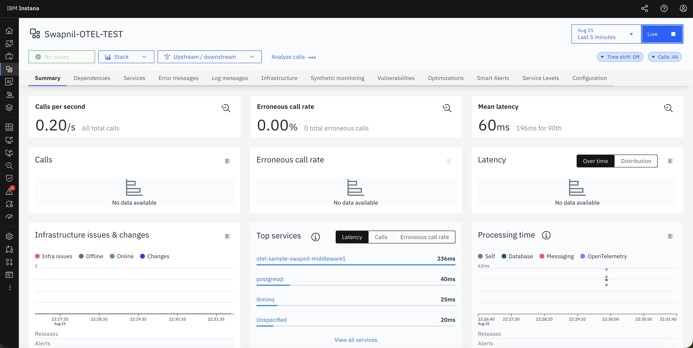
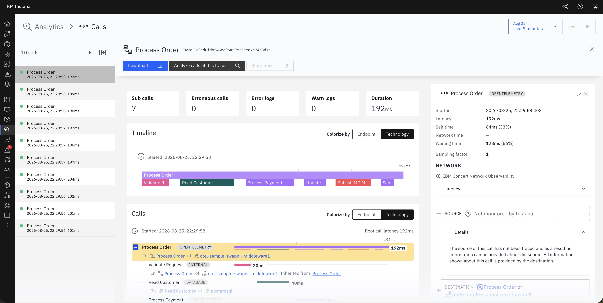
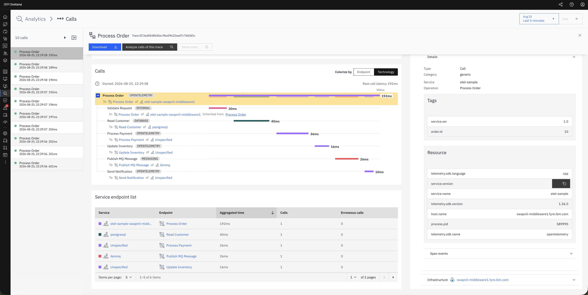
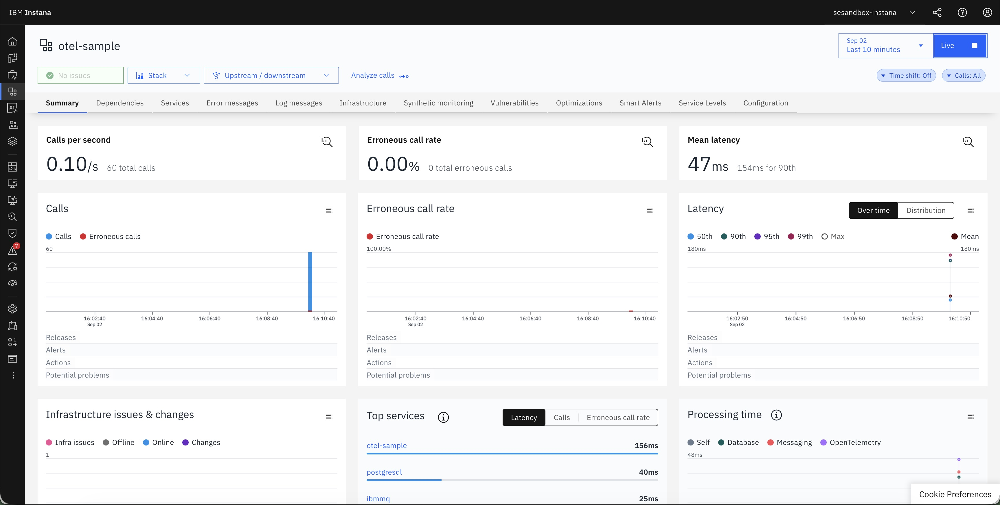
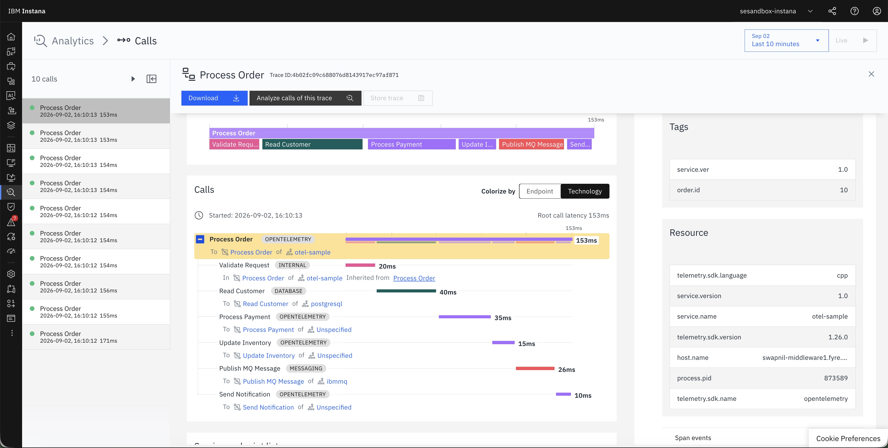

# IDOT OpenTelemetry C++ Sample

This sample shows how to build and run a C++ application that is instrumented
with the **Instana Distribution of OpenTelemetry (IDOT) C++ library** and sends
traces to an OTLP/gRPC collector.

The included sample application instruments a minimal order-processing workflow
and exports traces over OTLP/gRPC - giving you a working reference for span
creation, child spans, attributes, events, and context propagation with the
IDOT C++ library.

---

## Prerequisites

| Requirement | Notes |
|---|---|
| C++17 compiler | GCC 9+ or Clang 10+ (Linux); IBM XL C/C++ or GCC (AIX); MSVC 2019+ (Windows) |
| CMake 3.16+ | `cmake --version` |
| [IDOT package](https://link-to-idot-package) | Download and extract to a directory of your choice |
| OpenSSL 3 | Required on all platforms - `libopentelemetry_cpp` links against it at runtime. Linux/AIX: install via the system package manager (`openssl-libs` / `openssl`). Windows: add `libssl-3-x64.dll` / `libcrypto-3-x64.dll` to `PATH` - available from [Win64 OpenSSL](https://slproweb.com/products/Win32OpenSSL.html) or bundled with Git for Windows. |

gRPC, Protobuf, and Abseil are statically embedded inside the IDOT library, no other libraries need to be installed.

---

## Step 1  -  Extract the IDOT package

Extract the downloaded IDOT package and point `OTEL_INSTALL` at it.
All subsequent steps use this variable.

**Linux / AIX**
```bash
export OTEL_INSTALL=/opt/otel-pkg
```

**Windows (Developer PowerShell for VS 2022)**
```powershell
$env:OTEL_INSTALL = "C:\otel-pkg"
```

---

## Step 2  -  Edit `config.yaml`

Set the `endpoint` to the host and port of your collector. Use the IP address
of the machine running the collector  -  `localhost` only works if the collector
is on the same machine as the application.

```yaml
service:
  name: otel-sample
  version: "1.0"

otlp:
  endpoint: 192.168.1.10:4317  # host:port of your collector  -  no scheme prefix (not grpc://...)
  insecure: true               # true = plaintext gRPC (no TLS)
  timeout_ms: 10000

sample:
  iterations: 10
```

| Collector | Default OTLP/gRPC port | Example endpoint |
|---|---|---|
| Instana Agent | `4317` | `192.168.1.10:4317` |
| OpenTelemetry Collector | `4317` (standard) or `24317` (common alternative) | `192.168.1.10:24317` |

> The sample was tested with the Instana Agent on `localhost:4317` and the
> OpenTelemetry Collector on `localhost:24317`  -  both on the same machine as
> the application. Replace `localhost` with the actual IP address if your
> collector is on a different host.

If `config.yaml` is not found the application falls back to `localhost:4317`
with 5 iterations.

---

## Step 3  -  Build and run

Run all commands from the `idot-cpp-sample` directory.

### Linux

```bash
# Configure
cmake -B build -DCMAKE_BUILD_TYPE=Release -DCMAKE_PREFIX_PATH=$OTEL_INSTALL

# Build
cmake --build build -j$(nproc)

# Run
LD_LIBRARY_PATH=$OTEL_INSTALL/lib64 ./build/otel-sample
```

### AIX

`OBJECT_MODE=64` selects the 64-bit toolchain and must be set before configuring.

```bash
export OBJECT_MODE=64

# Configure
cmake -B build -DCMAKE_BUILD_TYPE=Release -DCMAKE_PREFIX_PATH=$OTEL_INSTALL

# Build
cmake --build build -j$(nproc)

# Run
LIBPATH=$OTEL_INSTALL/lib64 ./build/otel-sample
```

### Windows

Open **Developer PowerShell for VS 2022** (*Start → Visual Studio 2022 → Developer PowerShell for VS 2022*).

`opentelemetry_cpp.dll` is copied next to the executable automatically after
each build. The OpenSSL DLLs must also be on `PATH` before running.

```powershell
# Configure
cmake -B build -DCMAKE_PREFIX_PATH="$env:OTEL_INSTALL" -A x64

# Build
cmake --build build --config Release

# Add OpenSSL to PATH (adjust to your installation)
$env:PATH = "C:\Program Files\OpenSSL-Win64\bin;$env:PATH"

# Run
.\build\Release\otel-sample.exe
```

---

## Expected output

```
=========================================
 OpenTelemetry C++ Sample
=========================================
Service   : otel-sample
Version   : 1.0
Endpoint  : localhost:4317
Iterations: 10

[1/10] Processing order...
[2/10] Processing order...
...
[10/10] Processing order...

Telemetry export completed successfully.
```

Spans appear in the collector immediately after the run completes.

---

## Sample traces

### IBM Instana

#### Service summary



#### Calls view



#### Trace details



### OpenTelemetry Collector

#### Service summary



#### Trace detail



---

## What the sample demonstrates

Each iteration emits one root span with six sequential child spans:

```
Process Order              SERVER    ~150 ms
├── Validate Request       INTERNAL   20 ms   validation.result=success
├── Read Customer          CLIENT     40 ms   db.system=postgresql
├── Process Payment        CLIENT     35 ms   payment.provider=SampleGateway
├── Update Inventory       CLIENT     15 ms   inventory.status=updated
├── Publish MQ Message     PRODUCER   25 ms   messaging.system=ibmmq
└── Send Notification      CLIENT     10 ms   notification.type=email
```

Resource attributes attached to every span:

| Attribute | Value |
|---|---|
| `service.name` | from `config.yaml` |
| `service.version` | from `config.yaml` |
| `host.name` | `gethostname()` at startup |
| `process.pid` | `getpid()` (Linux/AIX) or `GetCurrentProcessId()` (Windows) |
| `telemetry.sdk.language` | `cpp` (set automatically by the SDK) |

OpenTelemetry concepts used in `src/main.cpp`:

| Concept | Where |
|---|---|
| `TracerProvider` + `Resource` | `InitTelemetry()` |
| OTLP/gRPC exporter | `OtlpGrpcExporterFactory::Create()` |
| `SimpleSpanProcessor` | `SimpleSpanProcessorFactory::Create()` |
| Semantic conventions | `semconv::service::kServiceName` |
| Span start / end | `tracer->StartSpan()` / `span->End()` |
| Span kinds | `kServer`, `kClient`, `kProducer`, `kInternal` |
| Span attributes | `span->SetAttribute()` |
| Span events | `root->AddEvent()` |
| Context propagation | `trace::Scope` + `ChildOpts()` |
| Graceful shutdown | `ForceFlush()` + `Shutdown()` + `NoopTracerProvider` |

---

## Project structure

```
idot-cpp-sample/
├── CMakeLists.txt     -  build definition; selects ext_dll (Windows) or ext_so (Linux/AIX)
├── config.yaml        -  runtime configuration (endpoint, iterations, …)
├── README.md          -  this file
└── src/
    └── main.cpp       -  single source file
```

---

## Notes

- **`SimpleSpanProcessor`** sends each span synchronously on `span->End()`.
  For production use, switch to `BatchSpanProcessor` to avoid blocking the
  calling thread on every export.
- **`OBJECT_MODE=64`** is AIX-specific and has no effect on other platforms.
