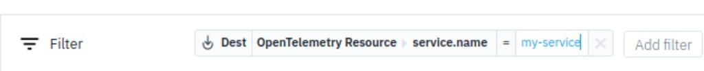
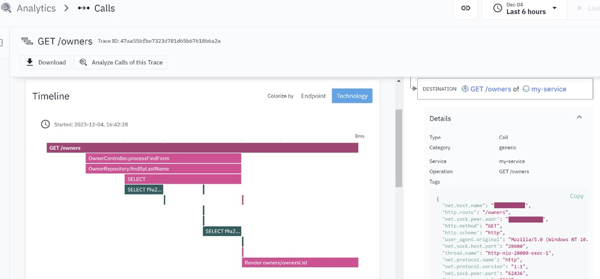
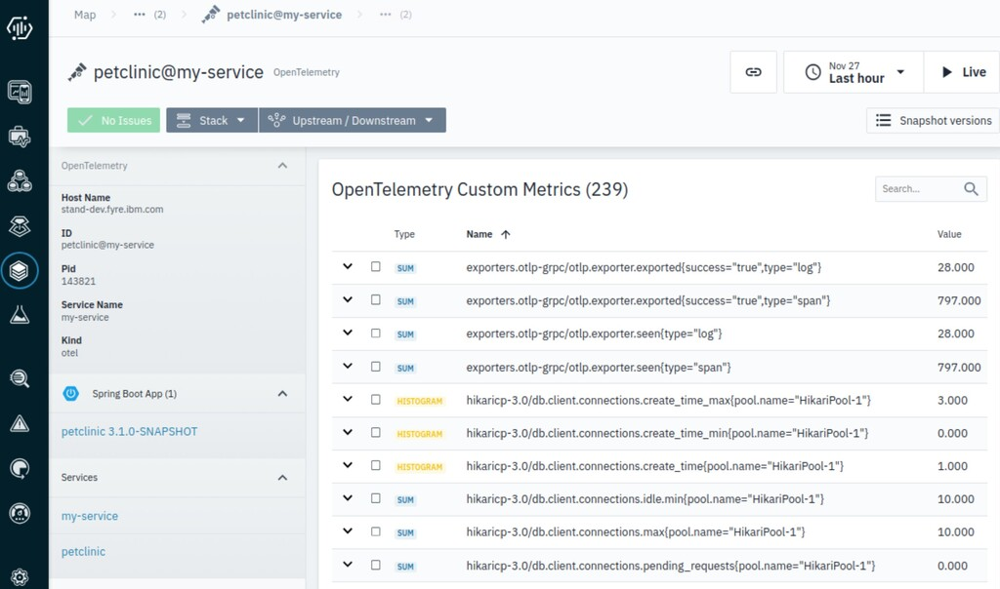

# Java

To get started with the OpenTelemetry integration quickly, see the following sample steps:

## Prerequisites

* Make sure that the Instana host agent is connected with the Instana backend.
* OTel requires JDK 8 or above.
* For the purposes of the demo below, make sure that JDK 17 or later is installed and that the JAVA_HOME and PATH environment variables are configured so that Java 17 works optimally.

## Auto-instrumentation integration steps

1. Configure the Instana agent configuration file to enable OpenTelemetry data ingestion as follows:

```
com.instana.plugin.opentelemetry:
  grpc:
    enabled: true
  http:
    enabled: true
```

2. Run the stop and start commands to restart your Instana agent, and ensure that the ports 4317 and 4318 are listened. Check the ports by running the following command:

```
netstat -an | grep 4317 
netstat -an | grep 4318
```

3. ownload the Spring Boot demo application by running the following command:

```
git clone https://github.com/spring-projects/spring-petclinic.git
```

4. Build the demo application by running the following command:

```
cd spring-petclinic ./mvnw clean package -Dmaven.test.skip=true
```

5. Download the OpenTelemetry Java agent by running the following command:

```
wget https://github.com/open-telemetry/opentelemetry-java-instrumentation/releases/download/v1.32.0/opentelemetry-javaagent.jar
```

6. Run the application with the OpenTelemetry Java agent as follows:

```
export OTEL_SERVICE_NAME=my-service
export OTEL_TRACES_EXPORTER=otlp
export OTEL_METRICS_EXPORTER=otlp 
export OTEL_LOGS_EXPORTER=otlp 
export OTEL_EXPORTER_OTLP_ENDPOINT="http://localhost:4317"
export OTEL_EXPORTER_OTLP_PROTOCOL=grpc
export OTEL_RESOURCE_ATTRIBUTES="service.instance.id=petclinic"
java -javaagent:./opentelemetry-javaagent.jar -jar target/*.jar --server.port=28080
```

7. Open a browser, and go to http://localhost:28080 or change to the IP address of the host that is running the demo application. Click the Find Owners menu and Find Owners button, and take whatever actions you like to generate the OpenTelemetry data.

8. Find the OpenTelemetry entity and its metrics.
    * Open the Instana UI, and click Infrastructure. Then, click Analyze Infrastructure.
    *  Select OpenTelemetry from the list of types of the entities. Click the entity instance that is named petclinic@my-service to open the associated dashboard and lists all its metadata and metrics. You can also use this OpenTelemetry entity in a custom dashboard.
        

9. Find the traces or calls of the OpenTelemetry entity.
    * Open the Instana UI, click Analytics, and then input the following filter:
        
      You can see a list of calls that you made. Click one of them to display the trace view of the OpenTelemetry call.
        

## Connect to Instana Self-hosted Backend (Kubernetes based)

In order to connect to the Instana Self-hosted backend, you must have the Instana backend installed. Please follow the follow instructions to set this up in a Red Hat OpenShift container platform or Kubernetes cluster: https://www.ibm.com/docs/en/instana-observability/current?topic=platform-installing

This process involves several prerequisites, such as understanding the Instana Operator, installing the self-hosted Instana backend, adhering to system requirements, and setting up/configuring the required data stores. The example code to do this is provided at the link above.

Once you have the Instana backend installed, you must make sure to connect to the backend, as shown in step 1 of the auto-instrumentation steps:

```
com.instana.plugin.opentelemetry:
  grpc:
    enabled: true
  http:
    enabled: true
```

Then, make sure your agent connects to the backend and make sure your OTel connector’s endpoint is as follows:

```
exporters:
  logging:
    verbosity: detailed
  otlphttp:
    endpoint: 'http://127.0.0.1:4318'
    tls:
      insecure: true
```

After this, you should see the OTel host by your local agent. 

## Manual-instrumentation integration steps

Manual instrumentation will require you to utilize the manual instrumentation tooling provided by OpenTelemetry Java, which is outlined below.

You can also reference the steps to enable manual instrumentation on the official OpenTelemetry documentation: https://opentelemetry.io/docs/languages/java/instrumentation/ 

First, let’s create a very simple app, and we will build and launch it. 
1. Create a directory `otel-sample`. Then, create a directory called build.gradle.kts with the following content:

```
plugins {
  id("java")
  id("org.springframework.boot") version "3.0.6"
  id("io.spring.dependency-management") version "1.1.0"
}

sourceSets {
  main {
    java.setSrcDirs(setOf("."))
  }
}

repositories {
  mavenCentral()
}

dependencies {
  implementation("org.springframework.boot:spring-boot-starter-web")
}
```

2. Then, let’s create a library file named Sample.java and add the following code:

```
package otel;

import java.util.ArrayList;
import java.util.List;

public class Sample {

    private int numberValue;

    public Sample() {
        this.numberValue = 1;
    }

    public List<Integer> playSample(int numTimes) {
        List<Integer> results = new ArrayList<Integer>();
        for (int i = 0; i < numTimes; i++) {
            results.add(addOne());
        }
        return results;
    }

    private int addOne() {
        return this.numberValue++;
    }
}
```

3. Create SampleApplication.java with the folllowing code:

```
// SampleApplication.java
package otel;

import org.springframework.boot.SpringApplication;
import org.springframework.boot.autoconfigure.SpringBootApplication;

import java.util.List;

@SpringBootApplication
public class SampleApplication {
    public static void main(String[] args) {
        SpringApplication.run(SampleApplication.class, args);

        // Create an instance of Sample
        Sample sample = new Sample();

        // Call playSample method and get the results
        List<Integer> results = sample.playSample(3);

        // Print the results
        System.out.println("Results: " + results);
    }
}
```

4. Ensure the app works by running it:

```
gradle assemble
java -jar ./build/libs/java-simple.jar
```

Following running, you should get an output of:

```
Results: [1, 2, 3]
```

Now that our app has been built, launched, and tested, we can now look into checking the data in Instana.

5. Configure the Instana agent configuration file to enable OpenTelemetry data ingestion as follows:

```
com.instana.plugin.opentelemetry:
  grpc:
    enabled: true
  http:
    enabled: true
```

6. Run the stop and start commands to restart your Instana agent, and ensure that the ports 4317 and 4318 are listened. Check the ports by running the following command:

```
netstat -an | grep 4317 
netstat -an | grep 4318
```

7. Add the latest versions of these packages to your configuration (e.g. Maven, Grade):

```
opentelemetry-sdk-extension-autoconfigure
opentelemetry-exporter-otlp
opentelemetry-semconv
```

Configure the following environment variables to set the temporality preference to delta and define the export parameters, substituting [URL] and [TOKEN] with the values for the base URL and access token.

8. Run the application with the OpenTelemetry Java agent as follows:

```
export OTEL_SERVICE_NAME=my-service
export OTEL_TRACES_EXPORTER=otlp
export OTEL_METRICS_EXPORTER=otlp 
export OTEL_LOGS_EXPORTER=otlp 
export OTEL_EXPORTER_OTLP_ENDPOINT="http://localhost:4317"
export OTEL_EXPORTER_OTLP_PROTOCOL=grpc
export OTEL_RESOURCE_ATTRIBUTES="service.instance.id=petclinic"
java -javaagent:./opentelemetry-javaagent.jar -jar target/*.jar --server.port=28080
```

9. You will need to add the following import statements to the startup class, which bootstraps the application:

```
import io.opentelemetry.api.common.Attributes;
import io.opentelemetry.sdk.OpenTelemetrySdk;
import io.opentelemetry.sdk.autoconfigure.AutoConfiguredOpenTelemetrySdk;
import io.opentelemetry.sdk.resources.Resource;
import io.opentelemetry.instrumentation.log4j.appender.v2_17.OpenTelemetryAppender;
```

Add the `initOpenTelemetry` method to your startup class and invoke it as early as possible during your application startup. This initializes OpenTelemetry for the Instana backend and creates default tracer and meter providers.

```
private static void initOpenTelemetry() {
    OpenTelemetrySdk sdk = AutoConfiguredOpenTelemetrySdk.builder().addResourceCustomizer((resource, properties) -> {
        Resource dtMetadata = Resource.empty();

        for (String name : new String[]{"dt_metadata_e617c525669e072eebe3d0f08212e8f2.properties", "/var/lib/dynatrace/enrichment/dt_metadata.properties"}) {
            try {
                Properties props = new Properties();
                props.load(name.startsWith("/var") ? new FileInputStream(name) : new FileInputStream(Files.readAllLines(Paths.get(name)).get(0)));
                dtMetadata = dtMetadata.merge(Resource.create(props.entrySet().stream()
                        .collect(Attributes::builder, (b, e) -> b.put(e.getKey().toString(), e.getValue().toString()), (b1, b2) -> b1.putAll(b2.build()))
                        .build())
                );
            } catch (IOException e) {
            }
        }

        return resource.merge(dtMetadata);
    }).build().getOpenTelemetrySdk();
    OpenTelemetryAppender.install(sdk);
}
```

10. Open a browser, and go to http://localhost:28080 or change to the IP address of the host that is running the demo application. Click the Find Owners menu and Find Owners button, and take whatever actions you like to generate the OpenTelemetry data.

11. Find the OpenTelemetry entity and its metrics.
    * Open the Instana UI, and click Infrastructure. Then, click Analyze Infrastructure.
    * Select OpenTelemetry from the list of types of the entities. Click the entity instance that is named petclinic@my-service to open the associated dashboard and lists all its metadata and metrics. You can also use this OpenTelemetry entity in a custom dashboard.
    

12. Find the traces or calls of the OpenTelemetry entity.
    * Open the Instana UI, click Analytics, and then input the following filter:
        
      You can see a list of calls that you made. Click one of them to display the trace view of the OpenTelemetry call.
            
    * You can see a list of calls that you made. Click one of them to display the trace view of the OpenTelemetry call.
        


