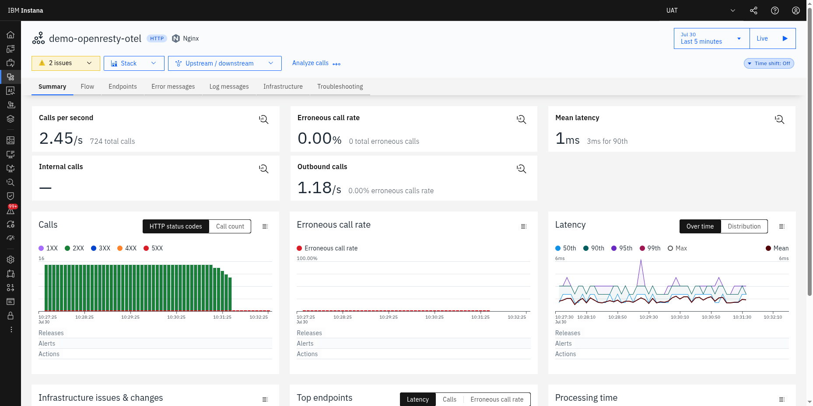
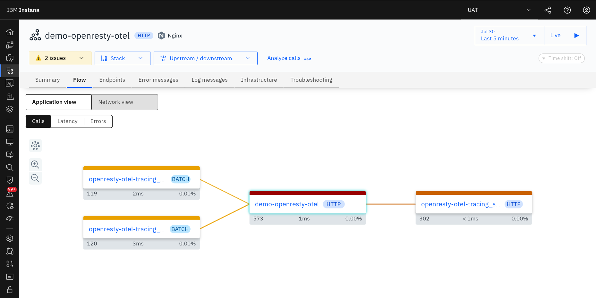
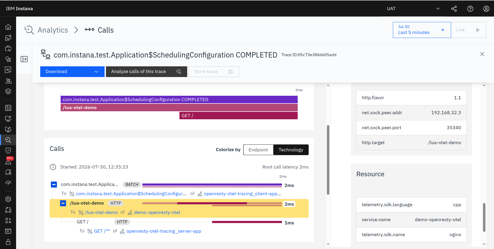
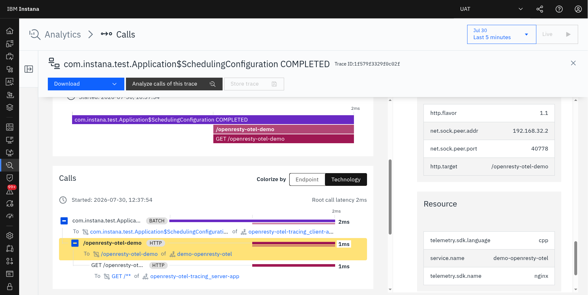

# Instana OpenResty OTel Tracing Demo

This repository contains a demo for Instana's [OpenResty](https://openresty.org/) OpenTelemetry tracing functionality.

This is based on the Instana variant of `nginx-otel` and a [lua-resty-http greater or equal 0.18.0](https://github.com/ledgetech/lua-resty-http/releases/tag/v0.18.0) with added W3C `traceparent` header support.

## Prerequisites

A `docker-compose` installation running on your machine. This demo has been created and tested on Mac OS X with `docker-compose` and `docker-machine`.

## Configure

Create a `.env` file in the root of the checked-out version of this repository and enter the following text, with the values adjusted as necessary:

```text
agent_key=<TODO FILL UP>
agent_endpoint=<local ip or remote host; e.g., ingress-red-saas.instana.io>
agent_endpoint_port=<443 already set as default; or 4443 for local>
agent_zone=<name of the zone for the agent; default: nginx-tracing-demo>
```

## Build & Launch

```bash
docker-compose down && docker-compose up --build
```

This will build and launch

- `client-app` service, a simple Spring Boot application that issues a request every second to the ...
- `openresty` service, which routes all incoming requests to the ...
- `server-app` service, a simple Spring Boot application that returns `200` to any HTTP request.
- `client-app-lua` service, same as `client-app`, but sends requests to the `lua-resty-http` target `/lua-otel-demo` of OpenResty instead.

After the agent is bootstrapped and starts accepting spans from OpenResty, the resulting traces are logged into files named `spans-<timestamp_ns>` in the directory `agent/logs`.

In the service dashboard this looks like the following:



In the flow graph this looks like the following:



In the analyze view for the `/lua-otel-demo` target this looks like the following:



In the analyze view for the regular NGINX `/openresty-otel-demo` target this looks like the following:



## Setup an Application Perspective for the Demo

The simplest way is just to assign to the agent a unique zone (the `docker-compose.yml` file comes with the pre-defined `openresty-otel-tracing-demo` zone), and simply create the application to contain all calls with the `agent.zone` tag to have the value `openresty-otel-tracing-demo`.
